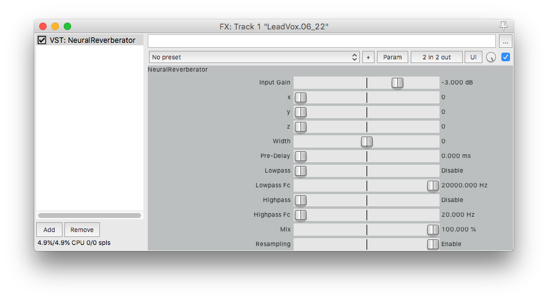
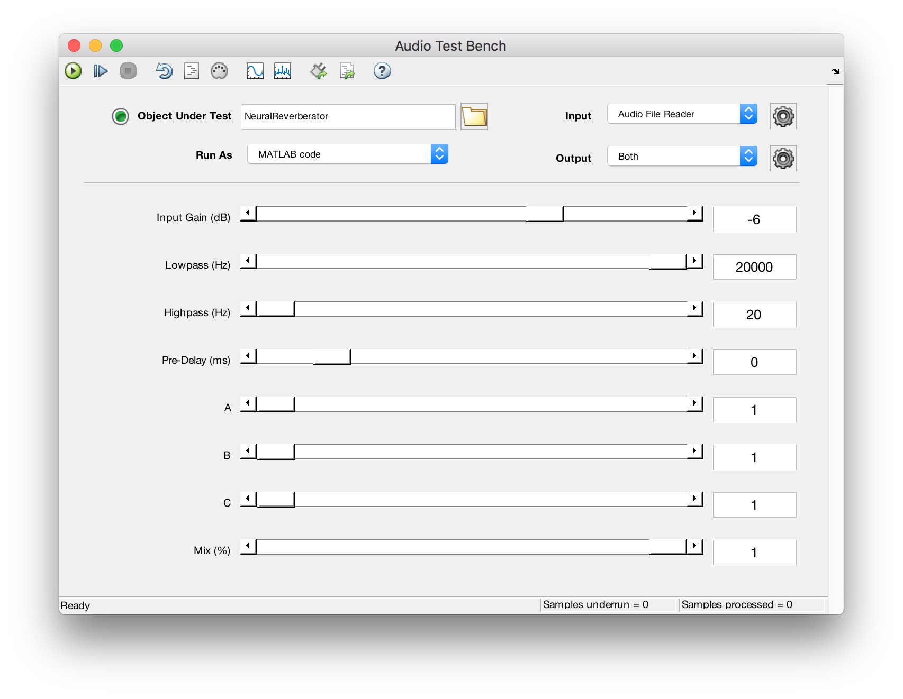
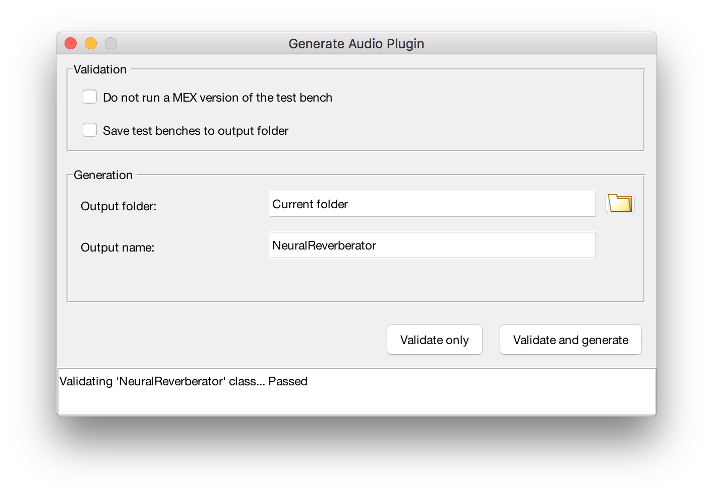
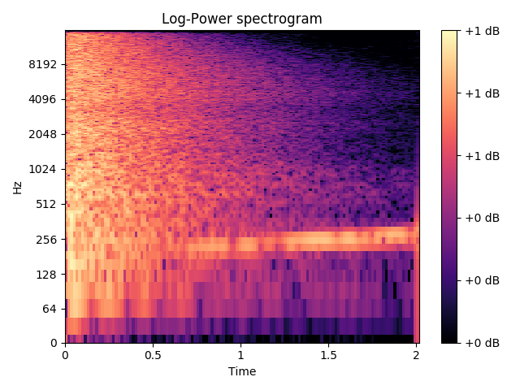

# NeuralReverberator
VST plug-in for room impulse responses synthesis via a spectral autoencoder.


> Running in REAPER64 on macOS

NeuralReverberator is a VST2 plug-in built with the MATLAB Audio System Toolbox. An autoencoder was trained in Keras using normalized, log-power spectra of room impulse responses downsampled to 16 kHz. 

After training the network, the decoder was used to generate log-power spectra for 2000 room impulse responses. This was achieved by navigating through the three dimensional latent space of the model. A left and right channel were generated for each step by slightly perturbing the latent space embedding of the left channel and then passing it through the decoder to generate the right channel. 

Librosa was used to perform a transformation to audio samples that match the generated log-power spectra with the use of the Griffin-Lim algorithm. These .wav files were then loaded into a MATLAB struct and then could be loaded in the AudioPlugin class where these room impulses can be convolved with input audio in a DAW.

## Install
You can download builds of the compiled VST2 plug-in below:
* [64-bit macOS](https://drive.google.com/open?id=1V4gkSTsCwdWzbczlKe73U6t86WilxElq)
* 64-bit Windows
* 32-bit Windows
> Windows builds will be available shortly

Once you have downloaded the proper build you need to place it in the directory where your DAW expects to find VST2 plugins. 

On macOS this is commonly `Library/Audio/Plug-ins/VST` 
or on Windows commonly `C:\Program Files\Common Files\VST2`.

After restarting your DAW you should see the plug-in appear as `NeuralReverberator`

## Autoencoder Latent Space

> Traversing the latent space of the trained model

## Controls
The VST plug-in interface provides the user with a number of controls.

#### Input Gain 
Allows the input signal fed to the convolution to be attenuated if clipping is occurring.
#### X Y Z
Controls to navigate the three dimensional latent space of the decoder. The range 0-9 corresponds to latent vector values between -2 and 2.
#### Width
Adjust the percieved stereo width by modifying the room impulse reponses used for the left and right channels. Mono mode when Width = 0 and Stereo mode when Width = 1. 
Other settings allow for extreme width and strange effects. 
#### Pre-Delay
Apply a delay to the wet signal to increase the time of arrival of first reflections.
#### Lowpass
Roll off high frequency content with an enable/disable and Fc control.
#### Highpass
Roll off low frequency content with an enable/disable and Fc control.
#### Mix
Ratio of the wet and dry signals at the output.
#### Resampling
Enable or disable resampling of the 16 kHz room impulse responses to match the current operating sample rate. This currently only supports samples rate of 32 kHz, 44.1 kHz, 48 kHz, and 96 kHz. All other samples rates will not result in resampling regardless of this controls setting. 

## Build
You can optionally build the plug-in from source with MATLAB.
This requires the following Toolboxes:
* [DSP System Toolbox](https://www.mathworks.com/products/dsp-system.html)
* [Audio System Toolbox](https://www.mathworks.com/products/audio-system.html)
* [MATLAB Coder](https://www.mathworks.com/products/matlab-coder.html)

To build the plugin in the `plug-in` directory open `NeuralReverberator.m` and then open the audioTestBench

```matlab
>> audioTestBench NeuralReverberator
```

This should open a window like the one shown below.


You can demo the plug-in as MATLAB code if you would like. Press the plug-in generation button in the top toolbar to bring up the `Generate Audio Plugin` window.



When you are ready to generate the plug-in press `Validate and generate`. This process will validate the plug-in code and then compile the MATLAB code down to C/C++ code to operate as a VST 2 plug-in. Note that this process can take up 15 minutes to complete and can consume a significant chunk of memory (up to 15GB).

> Note: MATLAB on Windows requires the Visual Studio C++ Compiler in order to build VST plugins

## Training
Data preprocessing, training, and output generation is all handled in Python with our good friends [Keras](https://keras.io/) and [librosa](https://librosa.github.io/librosa/). 

The room impulse response dataset to train the autoencoder is not provided due to licensing concerns. Trained models are provided in `train/models`. These can be loaded into Keras and used. An encoder and decoder are provided. 

The encoder expects a log-power spectogram of size (513, 128, 1) for channels last configuration. It will then produce a 3 dimensional latent representation of shape (1, 1, 1, 3). These can easily be flattened using `numpy.reshape()`. 

For example, below is the log-power spectra of a ~2 second impulse response.



When passed through the trained encoder it generates a 3 dimentional embedding.

`z = -0.68267184  0.5946066  -0.5709323`

The decoder expects a 3 dimentional latent representation of shape (1, 1, 1, 3) with float values (roughly in the range of -2 to 2) and produces a spectrogram of shape (513, 128, 1) which can be flattened down to (513, 128) and either plotted via `librosa.display.specshow()` or converted back to audio using the `ispecgram()` method located in util.py.

When the above latent representation is passed through the decoder it generates a spectrogram.


Notice that this spectrogram closely follows the characteristics of the input, but has been 'blurred'. This is a well established drawback of naive autoencoders. For listening examples check out the [blog post on my website]().